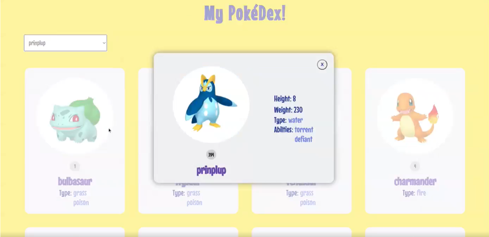

# Pokédex Project

## This is a project made using React, which aims to create a Pokédex, getting data from the [API](https://documenter.getpostman.com/view/10670805/SzS2xToN).

## Features:
This project implements the following features:
- Display all pokémons available on the API in cards;
- Open the card and show more information;
- Select a specific Pokémon and open its card;

## These are some preview images of the final project:

## [Video preview](https://www.linkedin.com/embed/feed/update/urn:li:ugcPost:6962792059661377536)
